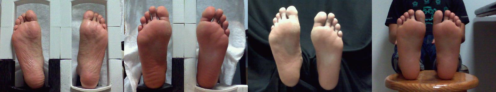
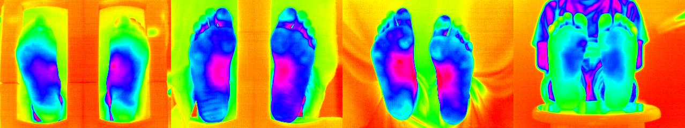

# Infrared thermography foot soles dataset

The dataset had a total of 108 Infrared thermography (IT) foot soles images with four different backgrounds. The backgrounds used are a structure made of  Acrylonitrile butadiene styrene (ABS) material, a modified support structure of ABS without lateral borders, a black background, and not under control background. For a more detailed explanation of the dataset, refer to the [official journal](https://www.sciencedirect.com/science/article/pii/S1350449519308217?utm_campaign=STMJ_75273_AUTH_SERV_PPUB&utm_medium=email&utm_dgroup=Email1Publishing&utm_acid=430846661&SIS_ID=-1&dgcid=STMJ_75273_AUTH_SERV_PPUB&CMX_ID=&utm_in=DM643380&utm_source=AC_30&utm_term=Email%201%20Publishing_TLSH_Reminder).






Each file includes:
* a visual spectrum image in JPG format.
* a matrix of measured temperatures in CSV format.
* a high contrast color map image of the temperatures distribution in JPG format.

## Infrared thermography camera
The camera used to build this dataset is the FLUKE TI32, with a dual system consisting of a visual spectrum camera and infrared thermography camera. The focal points were manually adjusted to the same position. The camera specifications are [here](https://www.fluke.com/es-es/producto/camara-termografica/ti32-eur).


## Citation
The dataset released in this repository is part of an automatic diabetic foot diagnosis work that you could find [here](https://www.sciencedirect.com/science/article/pii/S1350449519308217?utm_campaign=STMJ_75273_AUTH_SERV_PPUB&utm_medium=email&utm_dgroup=Email1Publishing&utm_acid=430846661&SIS_ID=-1&dgcid=STMJ_75273_AUTH_SERV_PPUB&CMX_ID=&utm_in=DM643380&utm_source=AC_30&utm_term=Email%201%20Publishing_TLSH_Reminder).  Thus, the citation of this repository requires to cite the journal too.

### Citation (repository)
Use this BibTeX to cite this repocitory:
```
@misc{database_IT_foot_soles,
  title={Infrared thermography foot soles dataset},
  author={H. Maldonado and R. Bayareh and A. Vera and L. Leija},
  year={2020},
  publisher={Github},
  journal={GitHub repository},
  howpublished={\url{https://github.com/malh12/Infrared-thermography-foot-soles-dataset}},
}
```
### Citation (Journal)
Use this BibTeX to cite the official paper:
```
@article{MALDONADO2020103187,
title = "Automatic detection of risk zones in diabetic foot soles by processing thermographic images taken in an uncontrolled environment",
journal = "Infrared Physics & Technology",
volume = "105",
pages = "103187",
year = "2020",
issn = "1350-4495",
doi = "https://doi.org/10.1016/j.infrared.2020.103187",
url = "http://www.sciencedirect.com/science/article/pii/S1350449519308217",
author = "H. Maldonado and R. Bayareh and I.A. Torres and A. Vera and J. Gutiérrez and L. Leija",
keywords = "Diabetic foot risk detection, Thermographic images processing, Deep-learning, Transfer learning, Thermography",
abstract = "Diabetes mellitus has become a global healthcare issue with incidence levels growing exponentially each year. Diabetic foot is one of the complications related with the ailment, and if it is not attended in time, it can progressively deteriorate to a condition that necessitates foot amputation. This study aimed to establish a non-invasive monitoring system for diabetic foot. This proposed system detects and classifies temperature differences in foot sole zones as ulcerous if >2.2 °C and necrotic if <−2.2 °C, by processing thermographic images of foot soles. This is achieved without homogeneous background or room temperature control. There are reports of systems that are designed to work under controlled environments; however, their performance declines or falters altogether under uncontrolled, home environments. The system proposed in this paper combines step-by-step and end-to-end algorithms that compensate for the limitations in data and, at the same time, enhance performance. It uses deep-learning techniques to segment visible-spectrum images using a retrained Mask R-CNN model, which is adjusted with 141 images to segment foot soles. These results are used over the temperature matrix in order to isolate the foot sole temperatures. The visualisation and classification methods use step-by-step algorithms with comparisons of homologous foot sole regions, convolutions with a two-dimensional (2D) Gaussian function, filters that process and compare areas of 1.5 cm2 over each foot sole, and a thermal threshold to differentiate ulcerous from necrotic zones. The results illustrated a detection accuracy of 90% for ulcers and 88% for necrosis, while the labelled areas had an error of 7.05% and 10%, respectively. These results demonstrated that the system is capable of successfully detecting and visualising the specific temperature differences over samples under an uncontrolled environment."
}
```


```python

```
